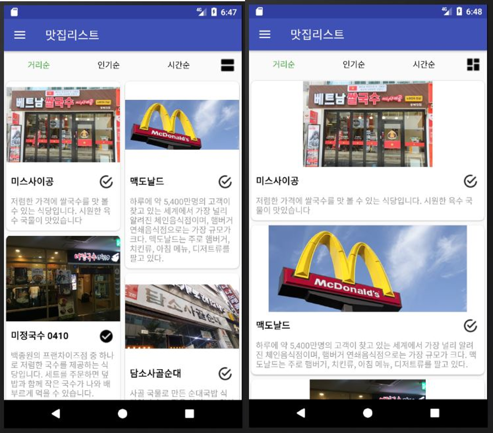

# 부스트캠프 프로젝트 모음
이 저장소는 부스트캠프 2기에서 진행한 프로젝트들입니다.

## FirstMiniProject
```
페이스북의 화면을 따라하는 1주차 과제입니다.
```

## BoostCampSample1
```
파이어베이스를 사용해보는 과제입니다.
인증, 실시간데이터베이스, 알림, 오류 보고
```
## SecondMiniProject

```
리사이클러뷰와 카드뷰 그리고 툴바를 사용하는 실습. 데이터를 처리하는 과정도 배워본다.
```



## ThirdMiniProject

```
구글 맵스와 데이터베이스 사용하기
```
